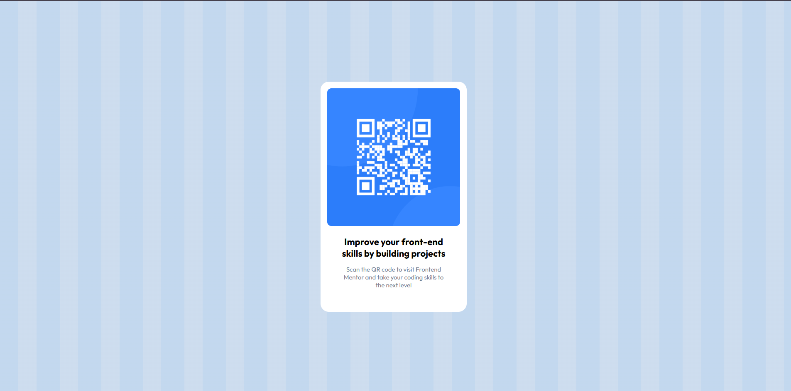

# Frontend Mentor - QR code component solution

This is a solution to the [QR code component challenge on Frontend Mentor](https://www.frontendmentor.io/challenges/qr-code-component-iux_sIO_H).

## Overview

### Screenshot

### Links
- Solution URL: [Frontend Mentor solution page]([ADD_YOUR_SOLUTION_URL_HERE])
- Live Site URL: [Live site]([https://qr-code-component-sigma-self-47.vercel.app])

## My process

### Built with
- Semantic HTML5 markup
- CSS
- Flexbox
- Google Fonts (Outfit)

### What I learned
- Centering a component with Flexbox (`justify-content` and `align-items`).
- Creating a striped background using `repeating-linear-gradient()`.
- Adding and applying a Google Font (Outfit) with multiple font weights.

### Continued development
- Make the layout fully responsive across different screen sizes.
- Rebuild this component using Tailwind CSS utilities.

### AI Collaboration
- Tools: Cursor
- How I used it: CSS debugging, layout tips, and documentation help (README drafting).

## Author
- Frontend Mentor - [@Gunyaluck](https://www.frontendmentor.io/profile/Gunyaluck)